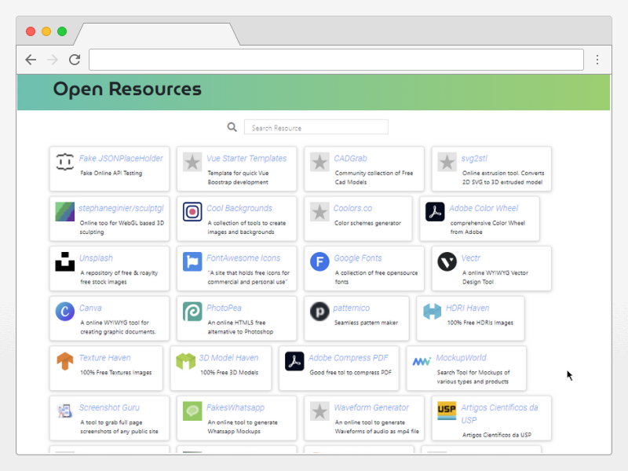

# Open Source Resources

A compiled list of known opensource resources, sources. boilerplates, and more.

To use it, simply go to the project [GitPage URL](https://thethales.github.io/OpenResources/)




## How does it work ?

The WebApp parses the Markdown specific structure into a JSON object that is used by the Vue app script to create a static page capable of search

### Why use markdown and not JSON directly?

In order to make it readable to everyone, human and computer alike, a simple bullet list makes more sense. And since basically everyone can compile a simple to do list on a daily basis, contributing to a text file is trivial.

### YAML ?

Considered that too, but it requires somewhat of a learning curve.

## How to Contribute

Fork the repository and edit the markdown bullet list adding your suggestion (following the current file structure), then submit a pull request for review.

As of now, a link resource is described as the first level on a bullet list and any following children are considered a property of said resource, e.g.:
> - CoolOpenSourceResource
>   - Link: _Describes the link_
>   - Description: _Short description of the resource_
>   - Img: _A link to a favicon or image, for ilustration purposes_
>   - License: _The Item License_
>   - LongDescription: _A long description of the item_
>   - Tags: _Relevant Search Tags_
>   - Type: _The type of the resource_
>   - Area: _The area of the resource_
>   - Why: _Why should one be interested in using it or for what would you use it for_

Template:

```markdown
- CoolOpenSourceResource
   - Link:
   - Description: 
   - Img:
   - License: 
   - LongDescription: 
   - Tags:
   - Type: 
   - Area: 
   - Why: 
 
```

## Tips &  Glossary

Part  of finding great resources on the web relies on smart search of terms and hotwords that sometimes are unique to the niche or areas, we are bulding said vocabulary here: see [glossary.md](glossary.md)

## Roadmap

- Adding Categories in Markdown as Headers
- Layout Improvement
- Error Handling
- Site Screenshot
- Side panel with more info regarding the selected link/tool
- Automatic site icon fetch
- Case Insensitivity
